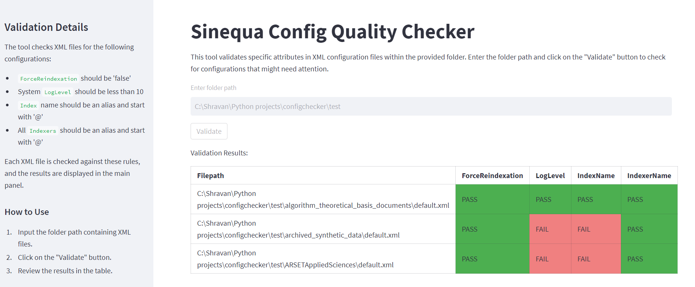

# **Sinequa Config Quality Checker**

A Streamlit-based application designed to validate specific XML configuration attributes. This tool aids in ensuring the integrity of configurations, a crucial step before promoting changes to STAGE and PROD environments.

## **🌟 Features**

- **Seamless Folder Path Input**: Easily specify the folder containing your XML configurations.
- **Real-Time Validation**: Instantly checks XML files and provides visual feedback.
- **Color-Coded Results**: Results are presented in a user-friendly, color-coded table format for swift and accurate assessment.

## **🚀 Getting Started**

1.  **Clone the repository:**

`**git clone https://github.com/shravanv90/SinequaConfigQualityCheck.git**`

2. Navigate to the project directory and install the required packages:

`cd sinequa-config-quality-checker`

3. Run the Streamlit app:

`streamlit run app.py`

## **🧐 Validation Checks**

The tool validates XML files for the following configurations:

- **ForceReindexation** should be set to 'false'
- System **LogLevel** should be less than 10
- **Index** name should be an alias
- All **Indexers** should also be an alias

## **💡 Usage**

1.  Input the folder path containing your XML configurations.
2.  Click the "Validate" button.
3.  Review the results in the presented table.
